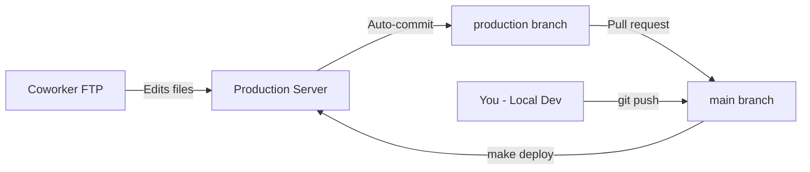

## Branch Strategy

We use a dual-branch strategy to accommodate both Git and FTP workflows:

| Branch | Purpose | Updated By |
|--------|---------|------------|
| `main` | Development team changes | Manual commits |
| `production` | Coworker's FTP changes | Auto-commits every 15 min |

## How It Works



### For Development Team

1. Work on `main` branch locally
2. Push changes to GitHub
3. Deploy to production with `make deploy`

### For Coworker (FTP)

1. Edit files via FTP/ShiftEdit
2. Cron job auto-commits every 15 minutes
3. Changes pushed to `production` branch
4. Team reviews via pull request

## Daily Workflow

### 1. Check for Coworker Changes

```bash
# See what coworker changed
make diff

# View recent auto-commits
make log

# Or open GitHub compare view
make compare
```

### 2. Review Changes

Open GitHub to see detailed changes:
```bash
# Open compare view in browser
open "https://github.com/my-marketing-pro/mmp-webapp/compare/main...production"
```

### 3. Merge if Needed

If coworker made changes you want to keep:

**Option A: Via GitHub (Recommended)**
1. Go to GitHub
2. Create pull request: `production` → `main`
3. Review changes
4. Merge pull request

**Option B: Via Command Line**
```bash
# Fetch latest from production branch
git fetch origin production

# Merge into main
git checkout main
git merge origin/production

# Resolve any conflicts
git add .
git commit -m "Merge coworker changes from production"
git push
```

### 4. Make Your Changes

```bash
# Ensure you're on main
git checkout main

# Make changes
# ... edit files ...

# Commit
git add .
git commit -m "Your descriptive message"

# Push to GitHub
git push origin main
```

### 5. Deploy to Production

```bash
# Deploy main branch to production server
make deploy

# This runs:
# ssh mymarketingpro "cd /var/www/sftp/app &&
#   sudo git stash &&
#   sudo git checkout main &&
#   sudo git pull &&
#   sudo git stash pop"
```

## Auto-Commit System

### How It Works

A cron job on the production server runs every 15 minutes:

```bash
# Cron schedule
*/15 * * * * /usr/local/bin/auto-commit-mmp.sh >> /var/log/auto-commit.log 2>&1
```

### Script Location

**File**: `/usr/local/bin/auto-commit-mmp.sh`

```bash
#!/bin/bash
cd /var/www/sftp/app
git checkout production 2>/dev/null
git add -A
if ! git diff --staged --quiet; then
    git commit -m "Auto-commit: $(date '+%Y-%m-%d %H:%M:%S')"
    git push origin production
fi
```

### What Gets Committed

- Any file changes in `/var/www/sftp/app/`
- Created by coworker via FTP
- Committed with timestamp: `Auto-commit: 2026-01-21 14:30:00`

### View Auto-Commit Log

```bash
# SSH into server
ssh mymarketingpro

# View log
tail -f /var/log/auto-commit.log

# View recent commits
cd /var/www/sftp/app
git log --oneline -20
```

## Common Commands

### Check Status

```bash
# Check coworker's changes vs your changes
make diff

# Check production server status
make status

# View recent auto-commits
make log
```

### Pull Latest Code

```bash
# Pull from main branch
make pull

# Pull from production branch (coworker changes)
make sync
```

### Deploy

```bash
# Deploy main branch to production
make deploy
```

### SSH Access

```bash
# SSH into production server
make ssh

# Or directly
ssh mymarketingpro
```

## Handling Conflicts

### Scenario: Coworker Edited Same File

If you and coworker edit the same file:

1. **Your changes** are in `main` branch
2. **Coworker's changes** are in `production` branch
3. **Conflict occurs** when merging

**Resolution:**

```bash
# Fetch coworker's changes
git fetch origin production

# Try to merge
git merge origin/production

# If conflict:
# 1. Open conflicted files
# 2. Look for conflict markers:
#    <<<<<<< HEAD
#    Your changes
#    =======
#    Coworker's changes
#    >>>>>>> origin/production

# 3. Manually resolve
# 4. Stage and commit
git add .
git commit -m "Merge production: resolved conflicts"
git push
```

### Scenario: Need to Rollback

If something breaks after deployment:

```bash
# Check recent commits
git log --oneline -10

# Rollback to previous commit
git reset --hard <commit-hash>

# Force push (careful!)
git push origin main --force

# Redeploy
make deploy
```

## Git Configuration

### Check Current Branch on Server

```bash
# SSH into server
ssh mymarketingpro

# Check branch
cd /var/www/sftp/app
git branch --show-current
```

**Should show**: `main` (unless coworker is actively editing via FTP)

### Switch Branches on Server

```bash
# Switch to main (for deployment)
sudo git checkout main

# Switch to production (for FTP access)
sudo git checkout production
```

## Best Practices

### 1. Always Pull Before Pushing

```bash
# Before starting work
git pull origin main

# Make changes
# ...

# Push
git push origin main
```

### 2. Review Auto-Commits Regularly

```bash
# Check weekly
make log

# Or open GitHub
make compare
```

### 3. Coordinate Big Changes

If making major changes, coordinate with coworker:
- Let them know when you'll deploy
- Ask them to pause FTP edits during deployment
- Review any pending changes first

### 4. Use Descriptive Commit Messages

```bash
# Bad
git commit -m "fixes"

# Good
git commit -m "Fix authentication redirect loop in app-auth.php:23"
```

### 5. Don't Force Push to Production Branch

The `production` branch is managed by auto-commits. Never:
```bash
# DON'T DO THIS
git push origin production --force
```

Let the cron job handle it.

## Troubleshooting

### Auto-Commits Stopped

```bash
# SSH into server
ssh mymarketingpro

# Check cron log
tail /var/log/auto-commit.log

# Check if script exists
ls -lh /usr/local/bin/auto-commit-mmp.sh

# Test script manually
sudo /usr/local/bin/auto-commit-mmp.sh
```

### Git Lock File Error

```bash
# On server
ssh mymarketingpro
cd /var/www/sftp/app

# Remove lock file
sudo rm -f .git/index.lock

# Try again
sudo git status
```

### Permission Denied

```bash
# On server, check ownership
ls -lh /var/www/sftp/app/.git/

# Should be owned by root or www-data
# If needed, fix permissions:
sudo chown -R www-data:www-data /var/www/sftp/app/.git/
```

## GitHub Integration

### Compare Branches

Compare what changed between branches:
```
https://github.com/my-marketing-pro/mmp-webapp/compare/main...production
```

### Create Pull Request

Create PR to merge `production` → `main`:
```
https://github.com/my-marketing-pro/mmp-webapp/pull/new/production
```

### View Auto-Commits

See all auto-commits from coworker:
```
https://github.com/my-marketing-pro/mmp-webapp/commits/production
```

## Next Steps

- [Development Workflow](/mmp-docs/workflows/development/) - Development best practices
- [Deployment](/mmp-docs/workflows/deployment/) - Deployment procedures
- [Makefile Commands](/mmp-docs/reference/makefile/) - Quick command reference
